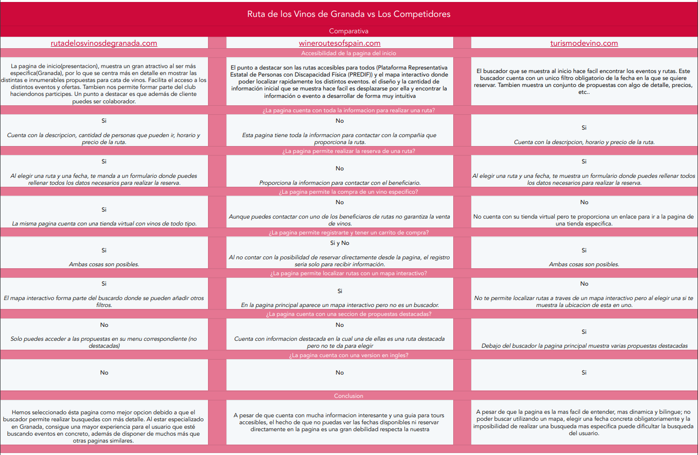
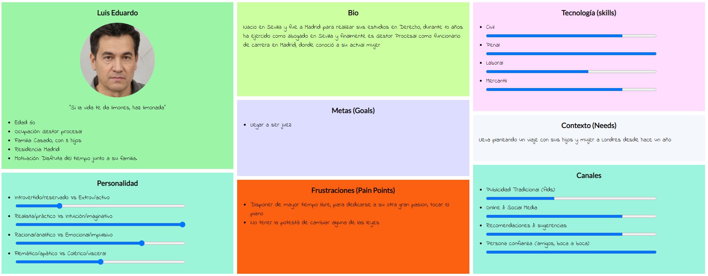
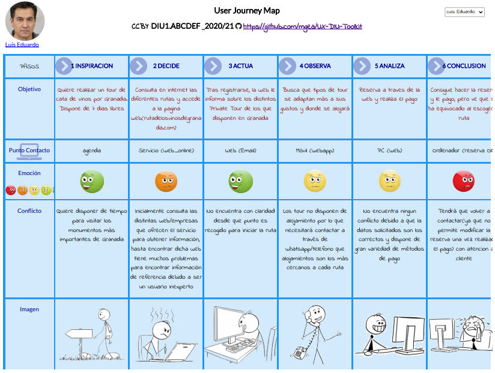

## DIU - Practica1, entregables

- Desk research: Análisis Competencia

  -  
- 2 Personas 

  - Teresa Mujica:
  - Luis Eduardo:
- 2 User Journey Map  ( 1 por persona)

  - Teresa Mujica:
  - Luis Eduardo:.........
- Revisión de Usabilidad: https://github.com/MiguelangelX72/DIU21/blob/master/P1/Usability%20Review.pdf

- Valoración y conclusiones de esta etapa:

  Despues de un analisis exhaustivo sobre la temática del enoturismo, sus diferentes ramificaciones y el analisis de sus competidores, tras aplicar las diferentes tecnicas (Analisis Competitivo, etc) nos ha hecho reflexionar sobre la gran importancia de todos los detalles para que el usuario final pueda obtener el maximo de satisfaccion. No eramos conscientes de los errores cometidos, que sin duda , son los que más nos han hecho aprender.
