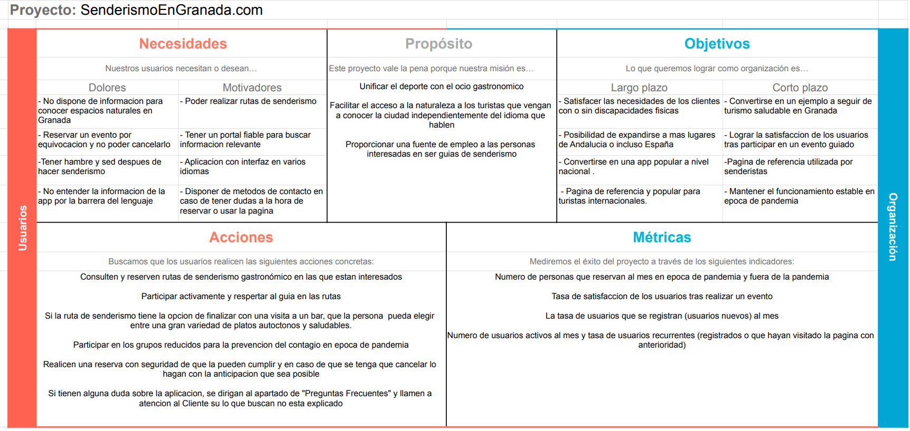
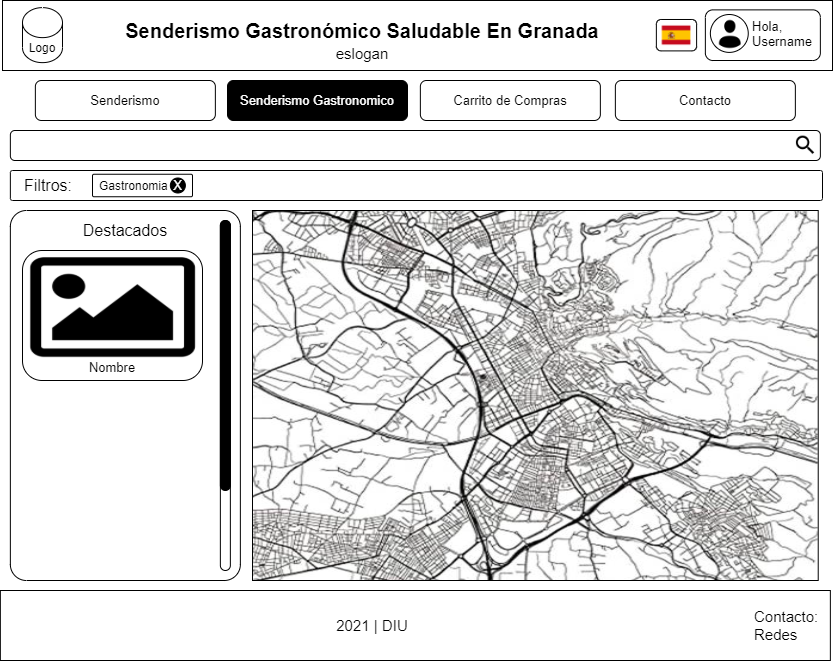
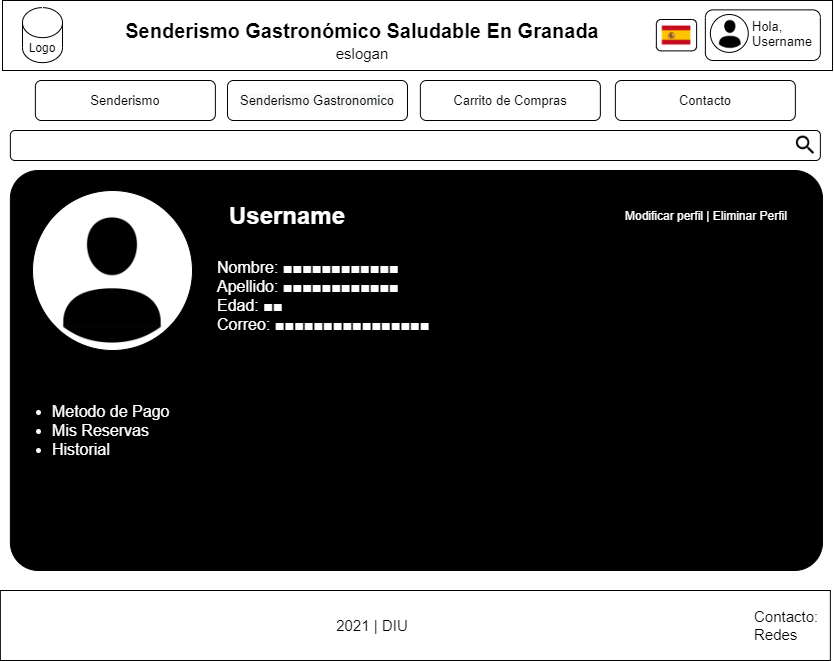

## DIU - Practica2, entregables

### Ideación 
* Malla receptora de información 
  * 

### PROPUESTA DE VALOR
* ScopeCanvas
  * 

### TASK ANALYSIS

* User Task Matrix 
  * 

### ARQUITECTURA DE INFORMACIÓN

* Sitemap 
  * 

* Labelling 

  |     Label                 |                          Scope note                          |
  | :-----------------------: | :----------------------------------------------------------: |
  |     Página principal      | Página de inicio del sitio web, contiene un menú de contenidos relevantes y el buscador gastronómico. |
  |Cambiar idioma de la página| Botón que permite cambiar el idioma de la página. |
  |     Buscador de Ruta      | Buscador principal de la página. Muestra rutas destacadas y permite buscar con texto y visualizar resultados tanto en bloque como en un mapa geográfico. |
  |     Mapa del Buscador     | El mapa geográfico que muestra el buscador tanto en la página principal como cuando se accede a una búsqueda. |
  |Aplicar filtros de búsqueda| Un submenú que permite poner filtros al buscador para facilitar la búsqueda. |
  |      Consultar ruta       | Apartado que muestra el trayecto que se va a realizar en la ruta junto con dos mapas: geográfico y de altitud. |
  |      Ver itinerario       | Lleva a la página de contacto con la empresa (se accede al pulsar el botón de Contáctanos) |
  |     Realizar reserva      | Botón que permite llenar un formulario para poderreservar puestos en una ruta. |
  |     Ver valoraciones      | Submenú de una ruta que permite ver las calificaciones que le han dado usuarios que han participado en esta. |
  |          Pagar            | Formulario que permite realizar la transacción de pago. |
  |        Mi perfil          | Botón que permite gestionar el perfil del usuario. |
  |     Gestionar perfil      | Subapartado de mi perfil que contiene opciones para gestionar los datos personales del perfil. |
  |        Ver perfil         | Botón que permite ver la información del perfil. |
  |      Eliminar perfil      | Botón que permite dar de baja el perfil del usuario. |
  |     Modificar perfil      | Formulario que permite modificar la información del perfil. |
  |      Método de Pago       | Botón que permite administrar el método de pago que se utilizara en las siguientes reservas. |
  |    Historial de rutas     | Botón que permite acceder a un menú donde se muestran todos las rutas que este usuario ha participado. |
  |    Valorar experiencia    | Formulario que permite valorar una experiencia al usuario que ya haya participado en esta. |
  |       Mis Reservas        | Botón que permite acceder a un menú donde te permite administrar las reservas (activas). |
  |    Consultar Reservas     | Botón que muestra todas las reservas realizadas (activas) |
  |     Cancelar reserva      | Botón que permite cancelar la reserva de la ruta. |
  |      Devolución Pago      | Enlace que estará disponible tras la cancelación de la reserva, permitiéndole la devolución del importe |
  |      Iniciar sesión       | Botón desde el cual el usuario se identificará, permitiéndole administrar su perfil etc posteriormente. |
  |        Registrarse        | Botón que mostrará un formulario donde pedirá los datos necesarios. |
  |          Contacto         | Enlace que da acceso a un Formulario y número de teléfono de contacto del servicio de atención al cliente, para que el cliente resuelva sus dudas. |
  |    Preguntas Frecuentes   | Conjunto de información, agrupado por diferentes temas para solucionar las dudas que suelen surgir inicialmente. |
  |      Redes Sociales       | Conjunto de botones a las redes sociales más usadas con información de la página. |

### Prototipo Lo-FI Wireframe 

- Página principal: 

- Buscador por Rutas: 

- Buscador por Gatronomia: 

- Mi Perfil: 

### Conclusiones  

En ésta etapa observamos los puntos clave desde otro punto de vista. Despues de lo aprendido con anterioridad podemos crear un nuevo proyecto con una temática diferente a la de la practica 1 pero con las mejoras en una nueva estructura más solida y de mayor exigencia. En cada etapa somos más conscientes de los errores comunes que solemos cometer cuando estamos desarrollando un proyecto.
