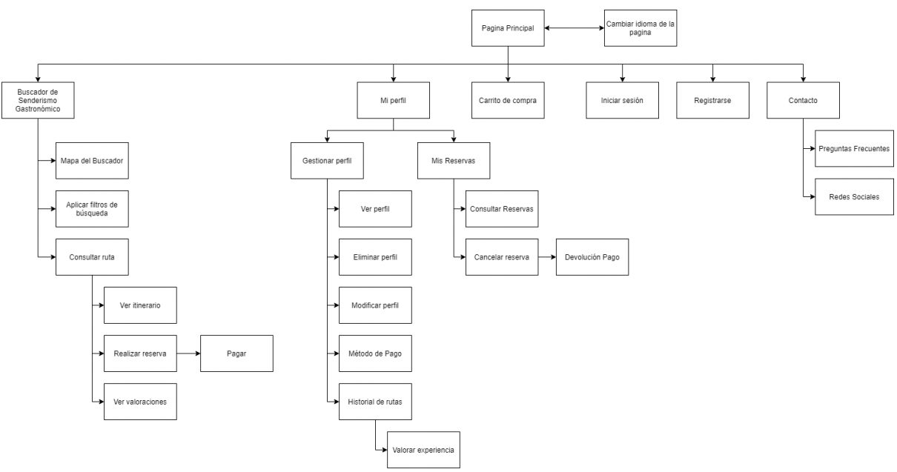

## DIU - Practica2, entregables

### Ideación 
* Malla receptora de información 
  * 

### PROPUESTA DE VALOR
* ScopeCanvas
  * 

### TASK ANALYSIS

* User Task Matrix 
  * 

### ARQUITECTURA DE INFORMACIÓN

* Sitemap 
  * 

* Labelling 

  |     Label                 |                          Scope note                          |
  | :-----------------------: | :----------------------------------------------------------: |
  |     Página principal      | Página de inicio del sitio web, contiene un menú de contenidos relevantes y el buscador gastronómico. |
  |Cambiar idioma de la página| Botón que permite cambiar el idioma de la página. |
  |     Buscador de Ruta      | Buscador principal de la página. Muestra rutas destacadas y permite buscar con texto y visualizar resultados tanto en bloque como en un mapa geográfico. |
  |     Mapa del Buscador     | El mapa geográfico que muestra el buscador tanto en la página principal como cuando se accede a una búsqueda. |
  |Aplicar filtros de búsqueda| Un submenú que permite poner filtros al buscador para facilitar la búsqueda. |
  |      Consultar ruta       | Apartado que muestra el trayecto que se va a realizar en la ruta junto con dos mapas: geográfico y de altitud. |
  |      Ver itinerario       | Lleva a la página de contacto con la empresa (se accede al pulsar el botón de Contáctanos) |
  |     Realizar reserva      | Botón que permite llenar un formulario para poderreservar puestos en una ruta. |
  |     Ver valoraciones      | Submenú de una ruta que permite ver las calificaciones que le han dado usuarios que han participado en esta. |
  |          Pagar            | Formulario que permite realizar la transacción de pago. |
  |        Mi perfil          | Botón que permite gestionar el perfil del usuario. |
  |     Gestionar perfil      | Subapartado de mi perfil que contiene opciones para gestionar los datos personales del perfil. |
  |        Ver perfil         | Botón que permite ver la información del perfil. |

### Prototipo Lo-FI Wireframe 

### Conclusiones  
(incluye valoración de esta etapa)
