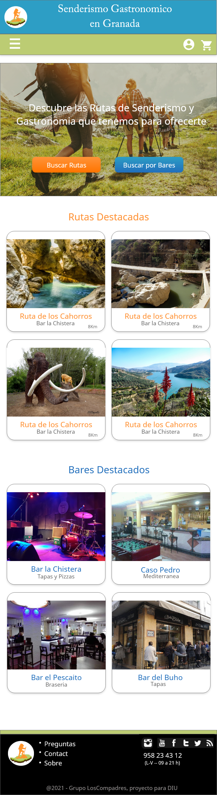

# DIU - Practica 3, entregables

## Moodboard (diseño visual + logotipo)   

* Logotipo

## Landing Page

## Mockup: LAYOUT HI-FI

- Página principal: 

- Menu Lateral: 

- Buscador por Senderismo: 

- Buscador por Gastronomia: 

- Informacion de una Ruta: 

- Reserva de una Ruta: 

## Documentación: Publicación del Case Study

(incluye) Valoración del equipo sobre la realización de esta práctica o los problemas surgidos
 
