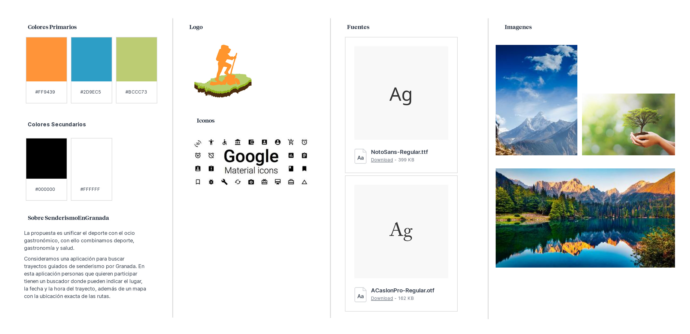
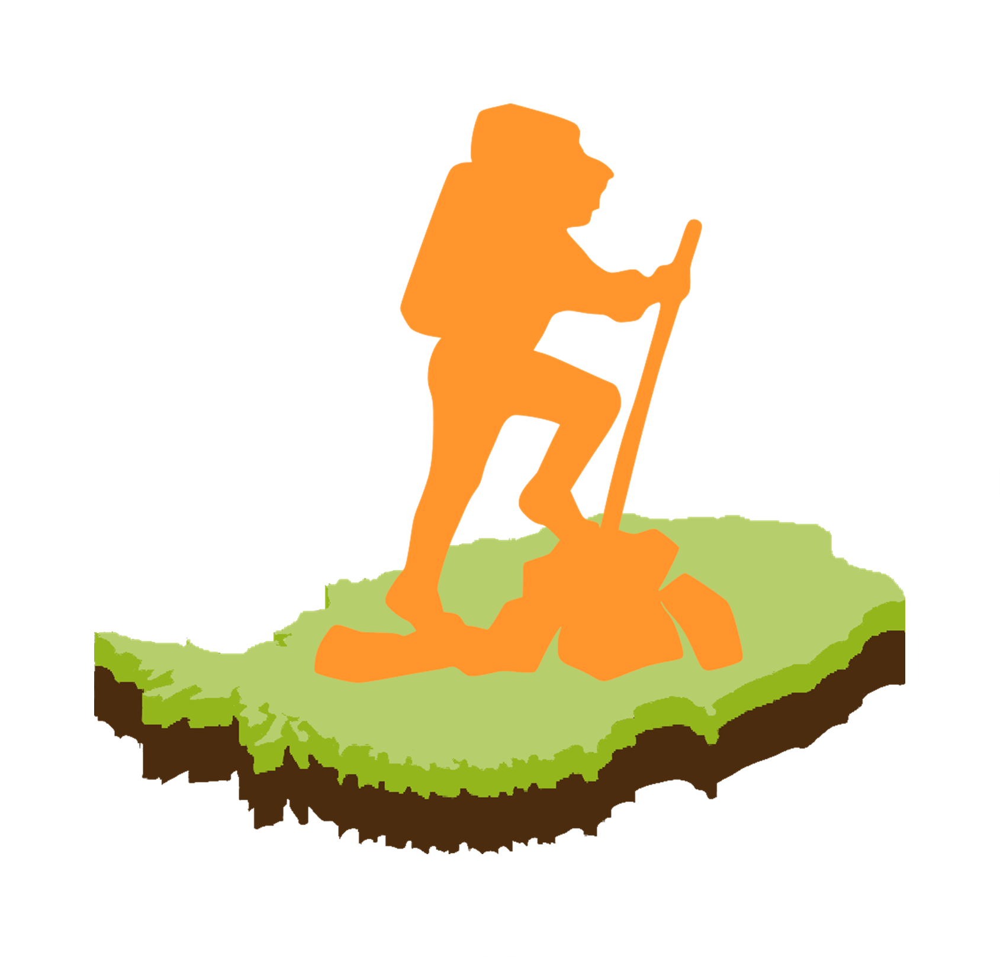
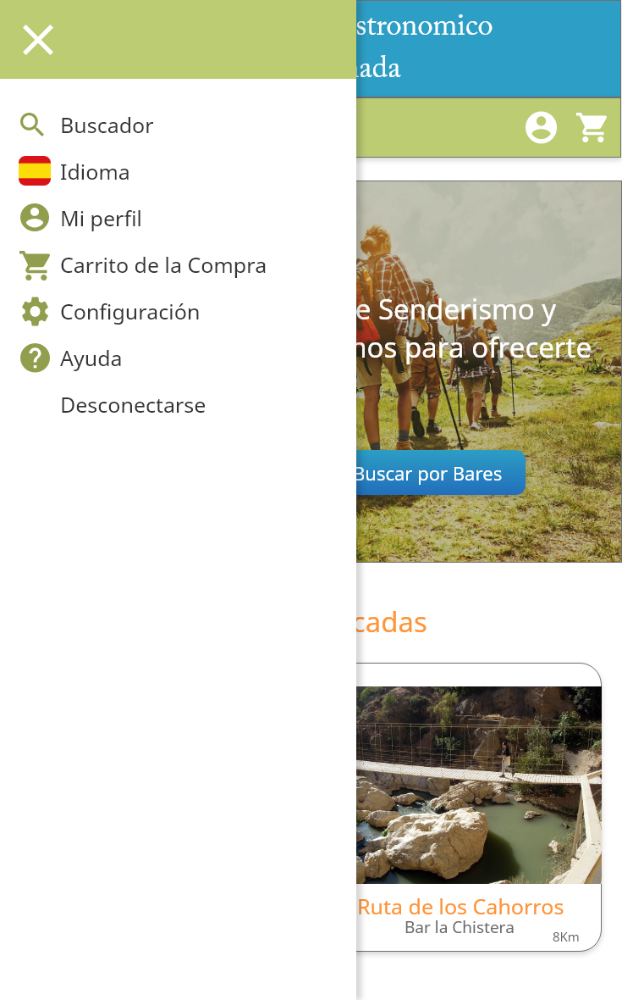
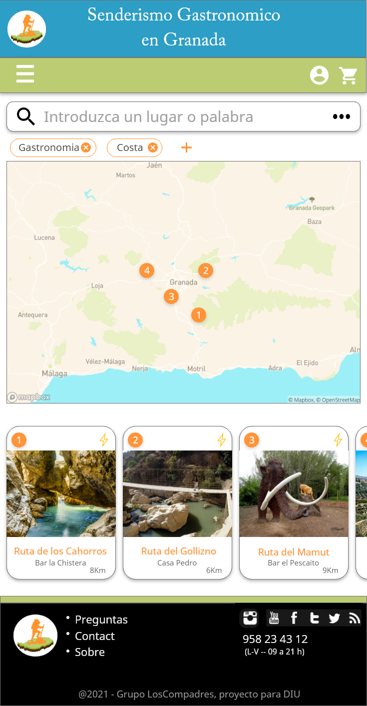

# DIU - Practica 3, entregables

## Moodboard (diseño visual + logotipo)   

* Logotipo

## Landing Page

## Mockup: LAYOUT HI-FI

- Página principal: 

- Menu Lateral: 

- Buscador por Senderismo: 

- Buscador por Gastronomia: 

- Informacion de una Ruta: 

- Reserva de una Ruta: 

## Documentación: Publicación del Case Study

Durante la realización de la prácticas hemos encontrado dificultades en centralizar todas las ideas que nos iban surgiendo, de manera que siempre fuera atractiva, facil y clara la utilización de nuestra aplicación para el usuario. Es por ello que hemos simplificado todo al maximo posible, siempre y cuando se le informara perfectamente de todos los servicios ofertados. 
 
