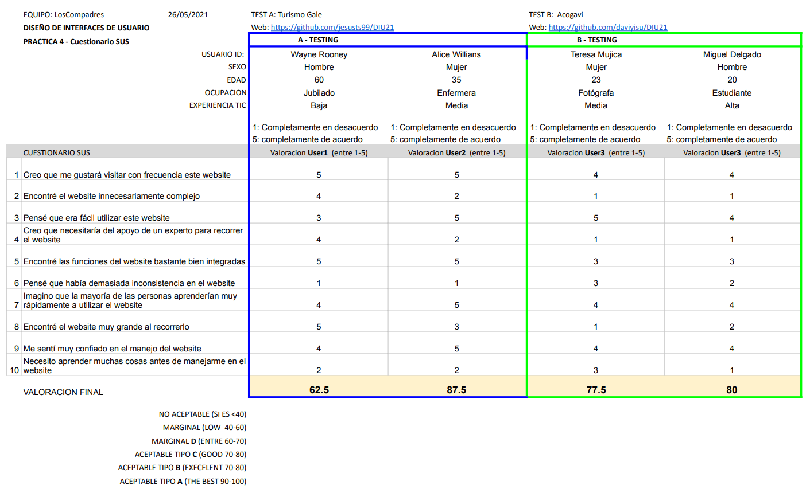

# DIU - Practica 4, entregables

## Caso A

Descripción: El equipo JTS bajo el proyecto "Turismo Galera" , ha diseñado una aplicacion destinada a usuarios extranjeros, con la finalidad de atraerlos hacia nuestra cultura y tradiciones.

Repositorio: https://github.com/jesusts99/DIU21

## Caso B

Descripción: El equipo tive2 diseño la aplicación "Acogavi", que es una aplicación para organización de viajes y hospedaje. Cuenta con un sistema de puntos que el usuario va acumulando, de manera que la proxima compra sera mas barata.

Repositorio: https://github.com/daviyisu/DIU21

# User Testing

>>> Wayne Rooney
>>> - Tipos: 6
>>> - Actividad (Acción): 4
>>> - Emociones: 4 (Surprise)
>>> - Después de jubilarse, decidió conocer la cultura española y para ello pensó en visitar Madrid. Necesita planificar su viaje durante los meses de Noviembre y Diciembre. Mientras realiza la búsqueda está sorprendido gratamente por la disponibilidad y servicios de los que se le ha puesto a su disposición.

>>> Alice Willians
>>> - Tipos: 2
>>> - Actividad (Acción): 2
>>> - Emociones: 6 (Sadness)
>>> - Desea visitar la provincia de Madrid junto a su familia. Su principal objetivo es que sus hijos conozcan el idioma y sus costumbres. Aunque muestra la aplicación una gran disponibilidad de eventos, todos están relacionados sobre conocer la ciudad pero no ha encontrado ninguno en el que sus hijos puedan practicar y aprender el idioma. Es por ello que muestra emoción de tristeza respecto a sus expectativas iniciales.

>>> Teresa Mujica
>>> - Tipos: 1
>>> - Actividad (Acción): 5
>>> - Emociones: 4 (Surprise)
>>> - Necesita encontrar en la aplicación un lugar tranquilo y sorprendente para viajar, donde pueda tomar buenas fotos, y aprovechar al maximo el descuento que le brindan los puntos que tiene en la aplicación.

>>> Miguel Delgado
>>> - Tipos: 4
>>> - Actividad (Acción): 3
>>> - Emociones: 1 (anger)
>>> - Necesita encontrar un lugar que tenga hospedaje con servicios especiales donde pueda disfrutar, ir a fiestas, no pasar un mal rato con los empleados y ganar puntos para viajes futuros.

| Usuarios | Sexo/Edad     | Ocupación   |  Exp.TIC    | Personalidad | Plataforma | TestA/B
| ------------- | -------- | ----------- | ----------- | -----------  | ---------- | ----
| Wayne Rooney  | H / 60   | Jubilado    | Baja        | Impulsivo    | Movil      | A 
| Alice Willians| M / 35   | Enfermera   | Media       | Extrovertida | Movil      | A 
| Teresa Mujica | M / 23   | Fotógrafa   | Media       | Emocional    | Movil      | B 
| Miguel Delgado| H / 20   | Estudiante  | Alta        | Racional     | Movil      | B 

# Cuestionario SUS

 

# Usability Report

>>> Reporte de Usabilidad (Acogavi): https://github.com/MiguelangelX72/DIU21/blob/master/P4/Informe%20de%20Usabilidad%20B%20(Acogavi).pdf

# Conclusiones

>>> Después del análisis realizado, hemos observado que la aplicación “Acogavi” muestra una gran aceptación por el usuario debido a un punto fuerte que es la simpleza. Gracias a ello, las opciones disponibles que se muestran en cada paso aportan al usuario la información necesaria para poder desenvolverse hasta conseguir su objetivo, evitando que el usuario se distraiga en opciones que no son determinantes en ese momento. Destacar que la experiencia del usuario juega a su favor en todo tipo de entornos, sin embargo uno de los usuarios no ha sido capaz de encontrar las preguntas frecuentes ya que solamente se encuentran en el apartado “Cartera” porque el usuario debe estar logueado. 
