# DIU21
Prácticas Diseño Interfaces de Usuario 2020-21 (Tema: Turismo) 

Grupo: DIU3_LosCompadres.  Curso: 2020/21 
Updated: 12/5/2021

Proyecto: 
>>> Senderismo Gatronomico en Granada

Descripción: 

>>> Una aplicación para buscar trayectos guiados de senderismo por Granada. Personas que quieren participar tienen un buscador donde pueden indicar el lugar, la fecha y la hora del trayecto, además de un mapa con la ubicación exacta de las rutas. Al elegir una ruta de senderismo gastronómico te muestra toda la información del recorrido, incluyendo el lugar de recogida, el lugar donde empieza el trayecto, los puntos por donde se pasa, el lugar donde termina, a qué bar se les va a llevar al terminar (para finalizar con una experiencia gastronómica autóctona del lugar y saludable) la ruta, las calorías que has quemado, las calorías consumidas(dependiendo el plato que escojas) y el costo por persona.
>>> Los usuarios indicarán con cuántas personas piensan ir y los datos de cada una. Se puede realizar el pago y la reserva directamente desde la aplicación. Una vez realizado el pago se puede anular dependiendo de cuántos días faltan para el evento, entre más cercana sea la fecha habrá una penalización que se le indicará con anticipación al usuario. La aplicación contará con versiones en varios idiomas y filtros avanzados que incluyen la búsqueda de rutas de senderismos adaptadas a personas con discapacidad.

Logotipo: 
>>> 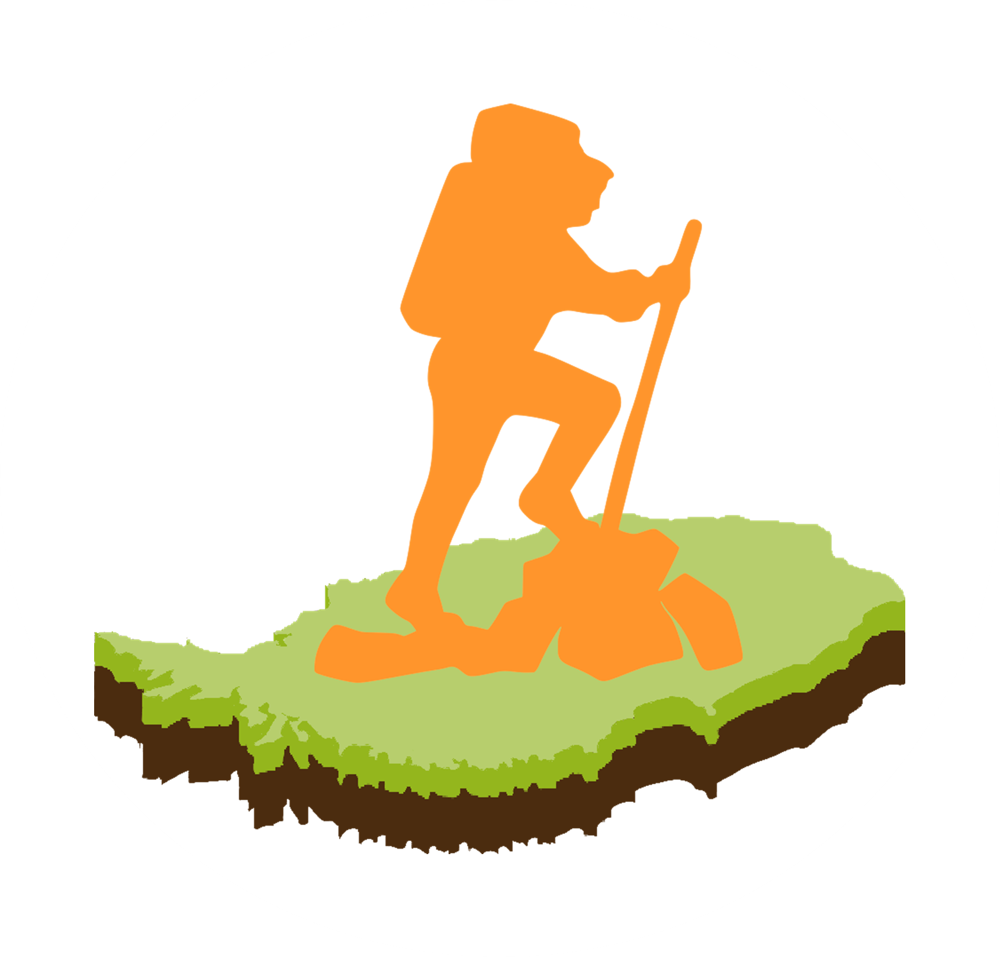

Miembros
 * :bust_in_silhouette:   Miguelangel Valderrama Perdomo     :octocat:     
 * :bust_in_silhouette:  Francisco Jose Miron Perez     :octocat:

----- 

# Proceso de Diseño 

## Paso 1. UX Desk Research & Analisis 

 1.a Competitive Analysis
-----

>>> Se ha elegido como caso de estudio las paginas web de rutas de vinos: rutadelosvinosdegranada.com, wineroutesofspain.com  y turismodevino.com
. Se ha elegido rutasdelosvinosgranada.com ya que esta especializada en Granada y tiene las funcionalidades con mas valor: pagina de inicio accesible, informa todos los detalles de las rutas, se reservan rutas desde la misma pagina, compra de vinos, carrito de compras, mapa interactivo, una seccion de propuestas destacadas y version en ingles 
>>> 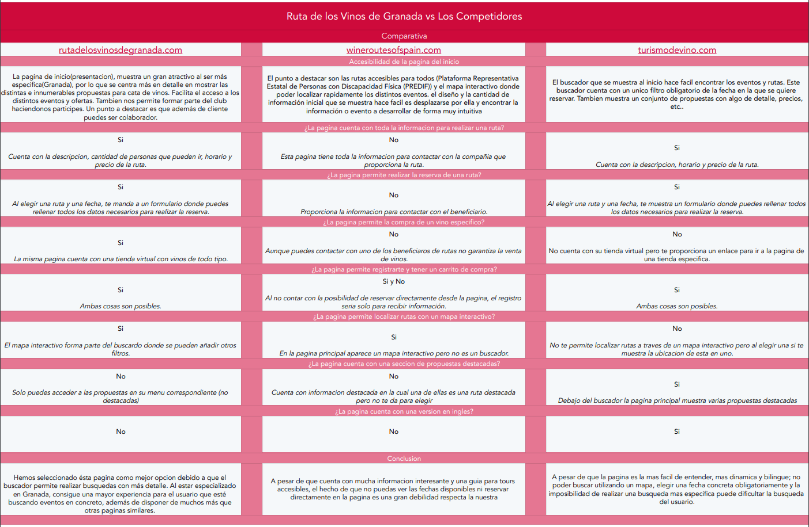

 1.b Persona
-----

>>> 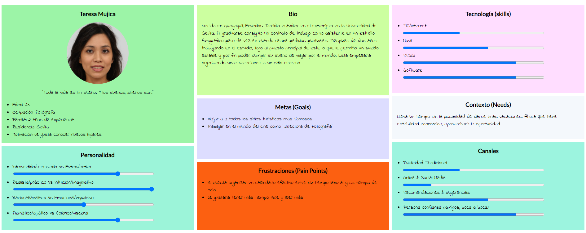
>>> La primera persona es Teresa Mujica, una extranjera que desde que tiene muchos años en España y no habia podido conocer el pais. Es una persona que quiere conocer y realizar nuevas experiences por lo que seria una buena candidata para interactuar con una pagina en cual no tiene experiencia en el tema pero si interes. 
>>> 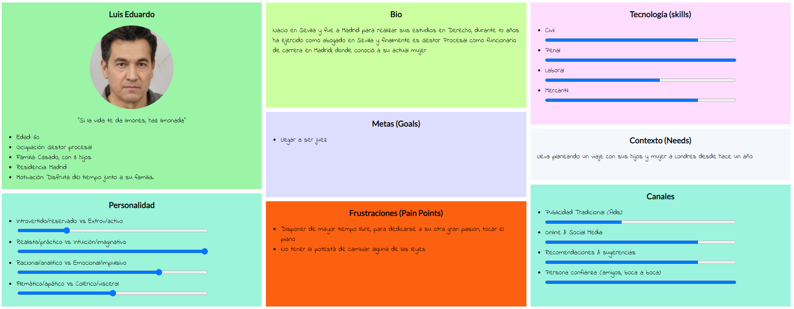
>>> Luis Eduardo, es un padre de familia que está buscando un plan nuevo para vacaciones(familiares). El inconveniente inicial es el desconocimiento el enoturismo y sus distintas actividades, pero que tras interactuar puede informarse acercandole a las actividades para disfrutar y relajarse con su familia.

 1.c User Journey Map
----

>>> 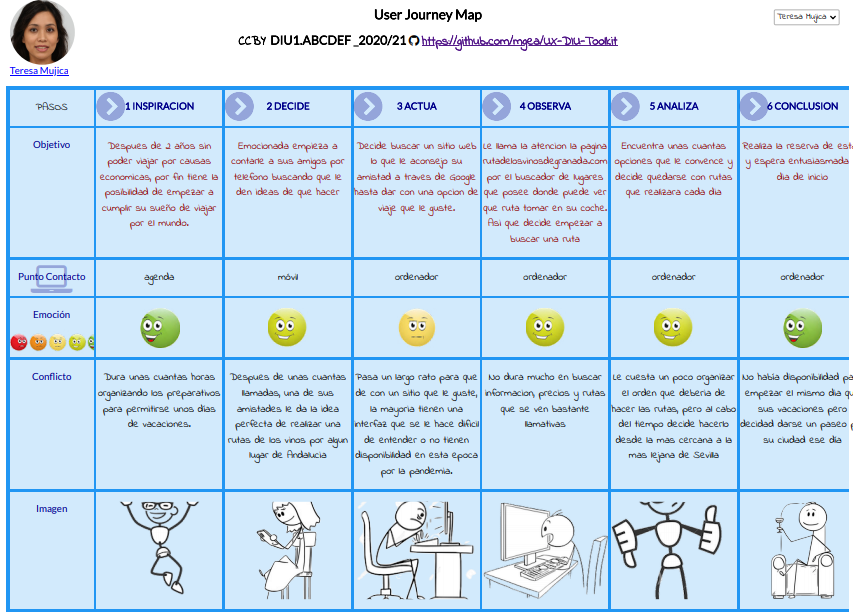
>>> A pesar de que a Teresa se le da muy bien la tecnologia y no tiene muchos problemas para interactuar con interfaces, Ella no tiene muchas ideas de por cual ruta deberia empezar y le cuesta mucho organizarse. La pagina rutadelosvinosdegranada.com le viene bien por su interfaz que muestra los horarios comodamente y su mapa interactivo pero aun asi el personaje tendria que poner de su parte. 
>>> 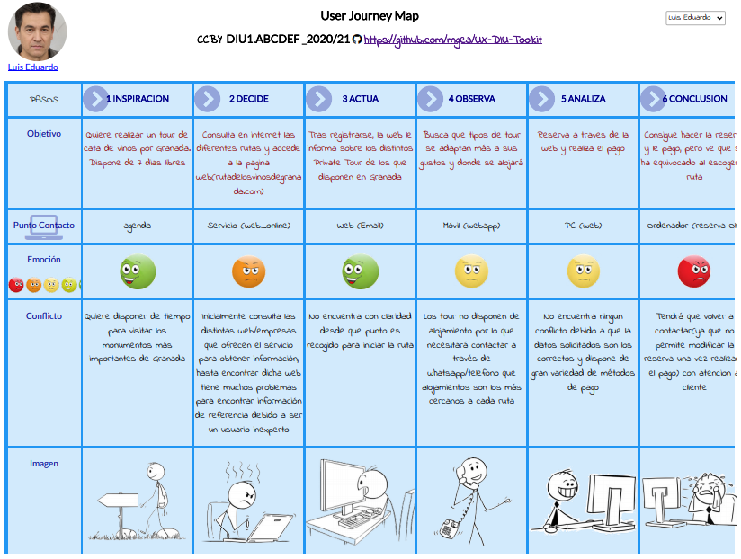

>>> Pese a que la interaccion con la página es agradable, Luis encuentra una serie de problemas principalmente por frustrarse con facilidad, porque lo que busca es que se le muestre la información de la forma más sencilla y agil posible, sin tener que dedicarle mucho tiempo para escoger una ruta. Debido a la facilidad de frustrarse es cuando el usuario comete más errores, que es por lo que finalmente quiere modificar una eleccion incorrecta de una ruta y la web no lo permite de forma directa.

 1.d Usability Review
----
>>>  Revisión de usabilidad: (toma los siguientes documentos de referncia y verifica puntos de verificación de  usabilidad
>>>> SE deben incluir claramente los siguientes elementos
>>> - Enlace al documento:  https://github.com/MiguelangelX72/DIU21/blob/master/P1/Usability%20Review.pdf
>>> - Valoración final (numérica): 87 - Good
>>> - Comentario sobre la valoración:  (60-120 caracteres)

## Paso 2. UX Design  

 2.a Feedback Capture Grid / EMpathy map / POV
----

>>> 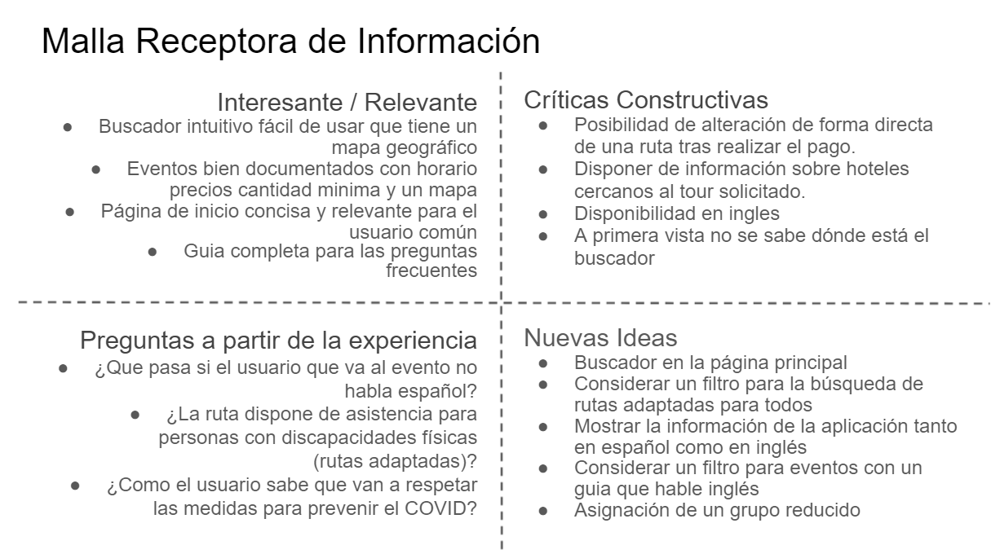
>>> Comenta con un diagrama los aspectos más destacados a modo de conclusion de la práctica anterior,

 2.b ScopeCanvas
----
>>> 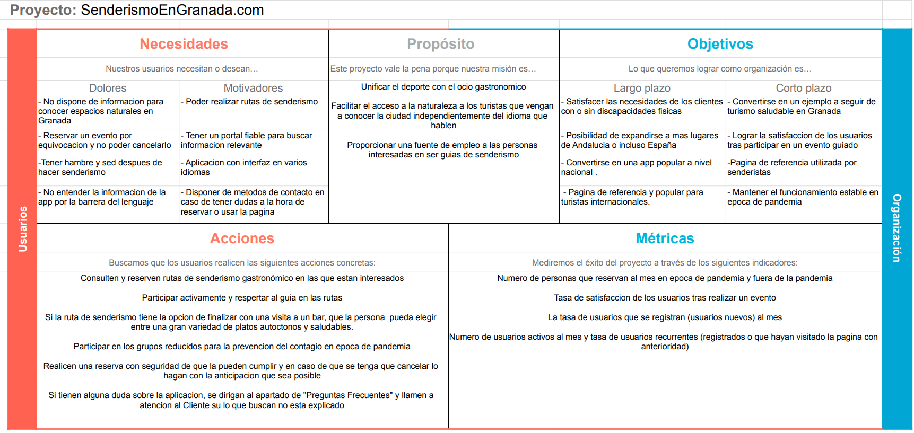
>>> Propuesta de valor 

 2.b Tasks analysis 
-----

>>> 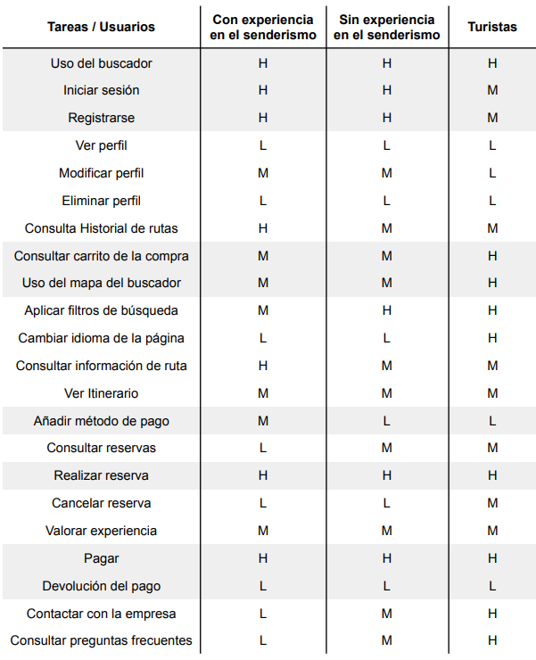
>>> Definir "User Map" y "Task Flow" ... 

 2.c IA: Sitemap + Labelling 
----

>>> Identificar términos para diálogo con usuario 
>>> 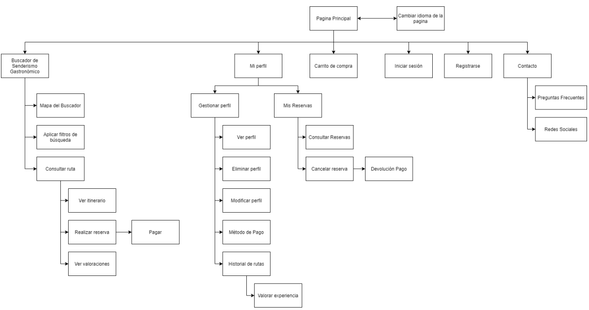 

 |     Label                 |                          Scope note                          |
  | :-----------------------: | :----------------------------------------------------------: |
  |     Página principal      | Página de inicio del sitio web, contiene un menú de contenidos relevantes y el buscador gastronómico. |
  |Cambiar idioma de la página| Botón que permite cambiar el idioma de la página. |
  |     Buscador de Ruta      | Buscador principal de la página. Muestra rutas destacadas y permite buscar con texto y visualizar resultados tanto en bloque como en un mapa geográfico. |
  |     Mapa del Buscador     | El mapa geográfico que muestra el buscador tanto en la página principal como cuando se accede a una búsqueda. |
  |Aplicar filtros de búsqueda| Un submenú que permite poner filtros al buscador para facilitar la búsqueda. |
  |      Consultar ruta       | Apartado que muestra el trayecto que se va a realizar en la ruta junto con dos mapas: geográfico y de altitud. |
  |      Ver itinerario       | Lleva a la página de contacto con la empresa (se accede al pulsar el botón de Contáctanos) |
  |     Realizar reserva      | Botón que permite llenar un formulario para poderreservar puestos en una ruta. |
  |     Ver valoraciones      | Submenú de una ruta que permite ver las calificaciones que le han dado usuarios que han participado en esta. |
  |          Pagar            | Formulario que permite realizar la transacción de pago. |
  |        Mi perfil          | Botón que permite gestionar el perfil del usuario. |
  |     Gestionar perfil      | Subapartado de mi perfil que contiene opciones para gestionar los datos personales del perfil. |
  |        Ver perfil         | Botón que permite ver la información del perfil. |
  |      Eliminar perfil      | Botón que permite dar de baja el perfil del usuario. |
  |     Modificar perfil      | Formulario que permite modificar la información del perfil. |
  |      Método de Pago       | Botón que permite administrar el método de pago que se utilizara en las siguientes reservas. |
  |    Historial de rutas     | Botón que permite acceder a un menú donde se muestran todos las rutas que este usuario ha participado. |
  |    Valorar experiencia    | Formulario que permite valorar una experiencia al usuario que ya haya participado en esta. |
  |       Mis Reservas        | Botón que permite acceder a un menú donde te permite administrar las reservas (activas). |
  |    Consultar Reservas     | Botón que muestra todas las reservas realizadas (activas) |
  |     Cancelar reserva      | Botón que permite cancelar la reserva de la ruta. |
  |      Devolución Pago      | Enlace que estará disponible tras la cancelación de la reserva, permitiéndole la devolución del importe |
  |      Iniciar sesión       | Botón desde el cual el usuario se identificará, permitiéndole administrar su perfil etc posteriormente. |
  |        Registrarse        | Botón que mostrará un formulario donde pedirá los datos necesarios. |
  |          Contacto         | Enlace que da acceso a un Formulario y número de teléfono de contacto del servicio de atención al cliente, para que el cliente resuelva sus dudas. |
  |    Preguntas Frecuentes   | Conjunto de información, agrupado por diferentes temas para solucionar las dudas que suelen surgir inicialmente. |
  |      Redes Sociales       | Conjunto de botones a las redes sociales más usadas con información de la página. |

 2.d Wireframes
-----

- Página principal: 

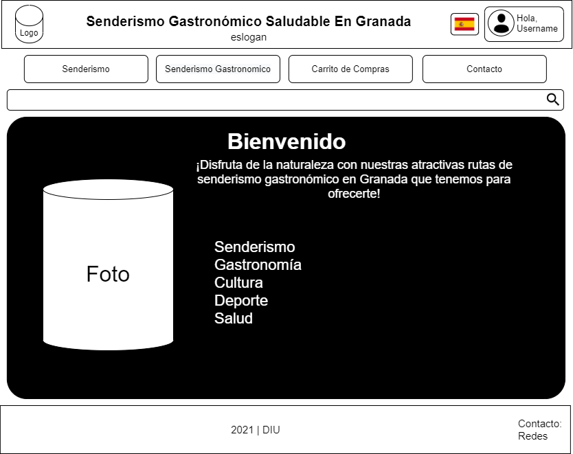

- Buscador por Rutas: 

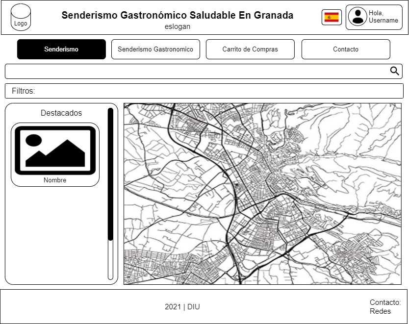

- Buscador por Gatronomia: 

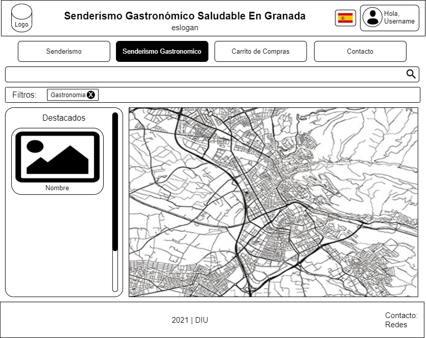

- Mi Perfil: 

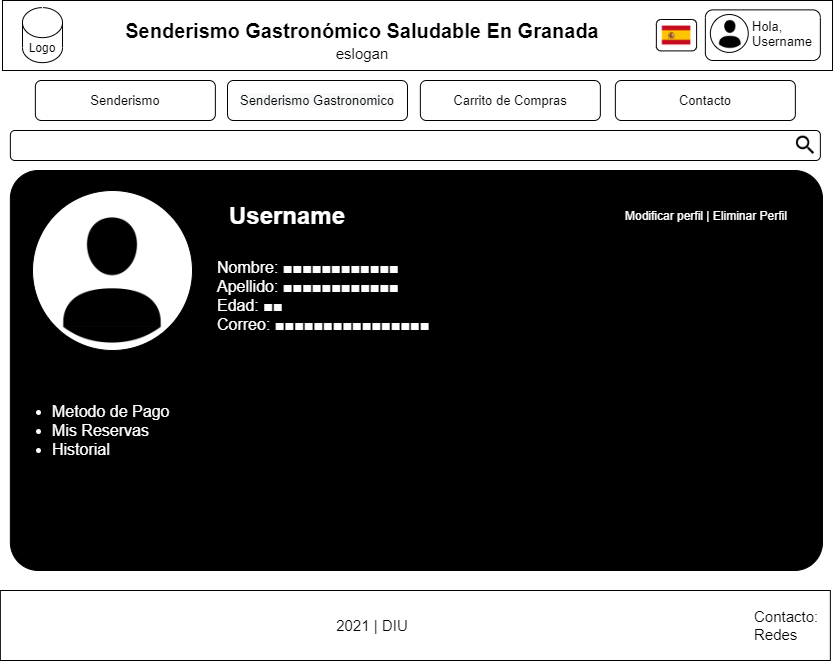 

## Paso 3. Mi UX-Case Study (diseño)

 3.a Moodboard
-----

>>> 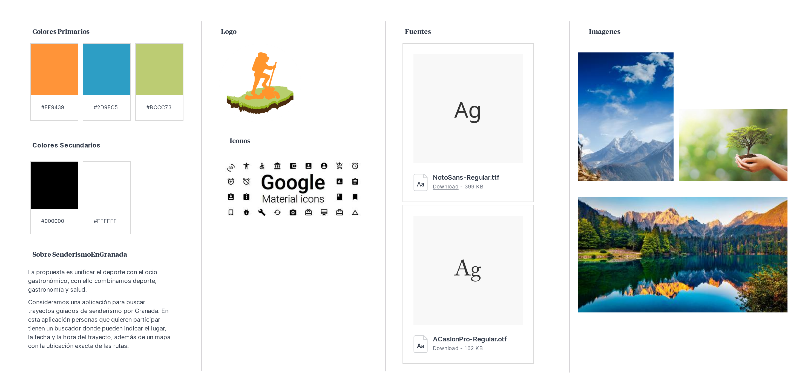
>>> Plantear Diseño visual con una guía de estilos visual (moodboard) 

>>> Logotipo

>>>

>>> Se ha utilizado Photoshop para el diseño del logotipo con una resolución de 1689x1618. Se puede usar este imagen logo como cabecera para cuentas de redes sociales

  3.b Landing Page
----

>>> 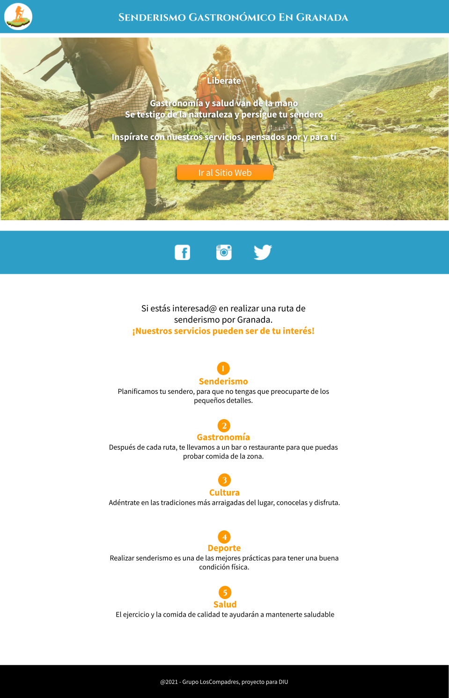
>>> Plantear Landing Page 

 3.c Guidelines
----

1. Breadcrumbs: Proporcionan información al usuario para ayudarles a entender donde están actualmente y como se puede retroceder.
2. Autocompletado y Sugerencias de Búsqueda: Estos patrones ayudarán al usuario a realizar una busqueda mas rapida y eficiente.
3. Scroll continuo: En caso de que la búsqueda del usuario resulte en demasiados  resultados, los menos relevantes no se cargan en memoria hasta que el usuario no llegue al final de la página donde se le indicará con un mensaje que se van a cargar más resultados.
4. Formato de Fecha y Tiempo: Se utilizara la zona horaria de Granada, el sistema horario de las 24 horas y el formato de fechas sera el dia de la semana, dia, mes y año
5. User input errors: Indicar al usuario los campos que le faltan para poder enviar el formulario.
6. Notificaciones: Para avisar al usuario cuando haya una actualización en una de sus reservas de rutas o en caso de que esté suscrito a un evento de interés.
7. Alerts with title bars: Utilice las alertas de la barra de título solo para situaciones de alto riesgo, como la posible pérdida de conectividad
8. Navegaciones: Para casi toda la página se usará una navegación multinivel pero para el formulario de reserva de una ruta, la navegación será secuencial (primero se rellenan los datos de los participantes y la fecha de asistencia y luego es que se puede realizar el pago de este).
9. Progress & activity (Circular) : Método para indicar al usuario si se está cargando o realizando alguna actividad. Consiguiendo que el usuario conozca en todo momento si debe esperar o no.
10. Diseño Material: La metáfora del diseño material es una teoría racionalizada del espacio y un sistema de movimiento. Está centrada en la realidad táctil e inspirada en el estudio de papel y tinta pero avanzada tecnológicamente y abierta a la imaginación. Las superficies y los bordes muestran pistas visuales basadas en la realidad y predomina el uso de atributos táctiles familiares para ayudar al usuario a entender las prestaciones de la aplicación.
11. Input line: La línea de entrada indica dónde introducir el texto, que se muestra debajo de la etiqueta.

>>> Tras documentarse, muestre las deciones tomadas sobre Patrones IU a usar para la fase siguiente de prototipado. 

  3.d Mockup
----
- Página principal: 

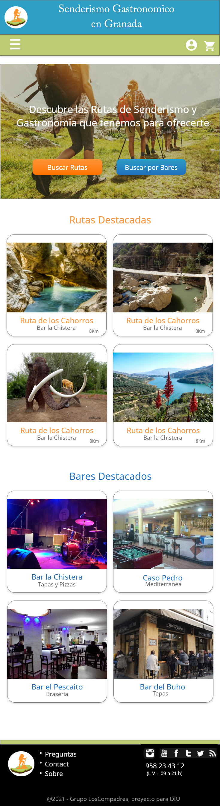

- Menu Lateral: 

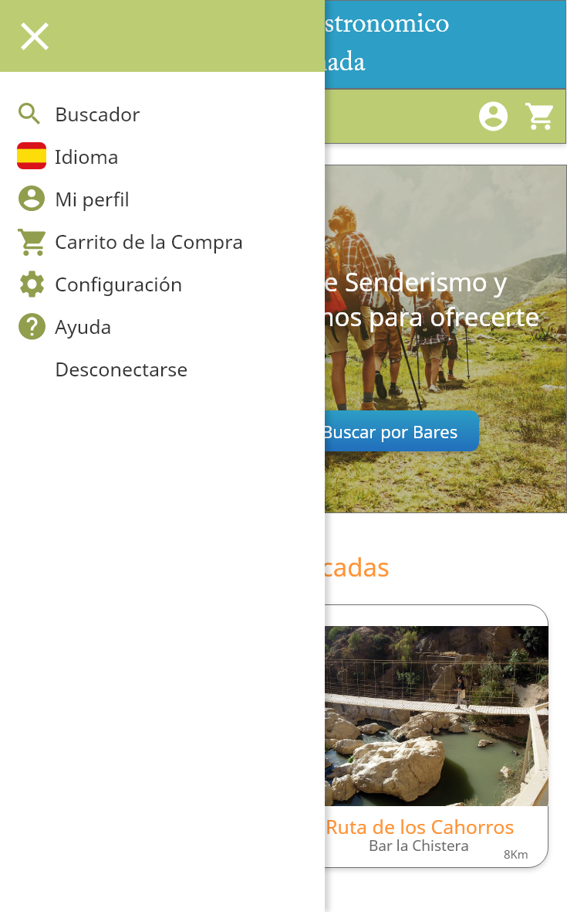

- Buscador por Senderismo: 

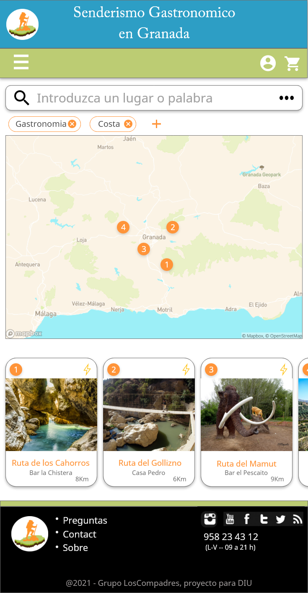

- Buscador por Gastronomia: 

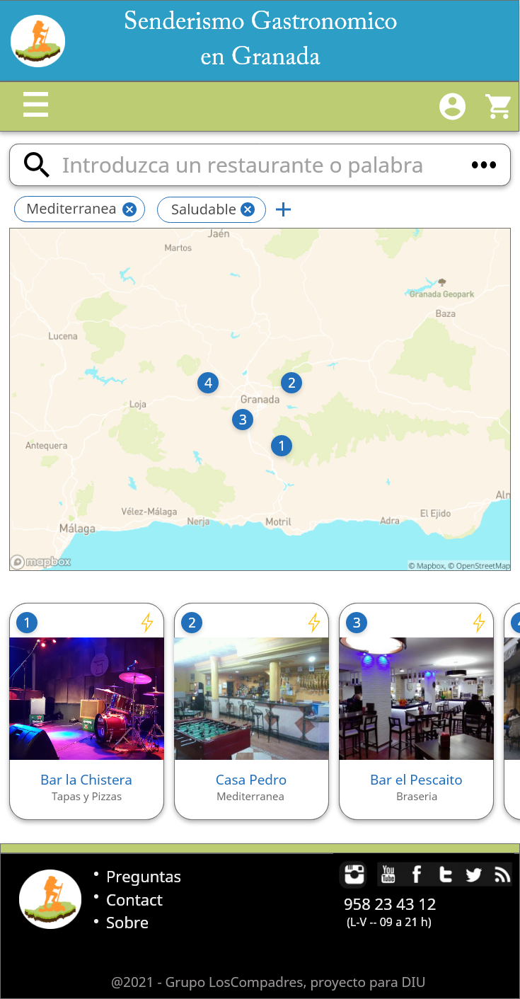

- Informacion de una Ruta: 

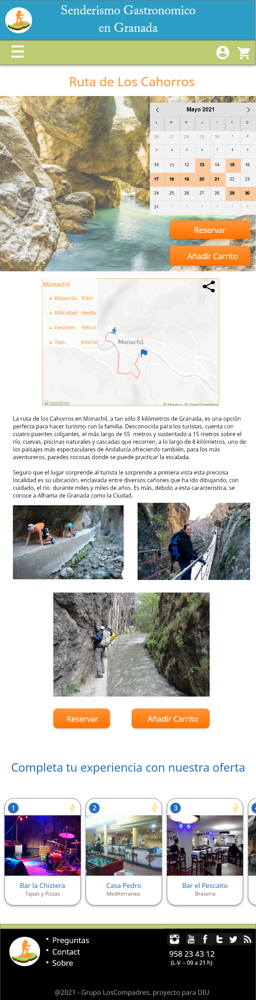

- Reserva de una Ruta: 

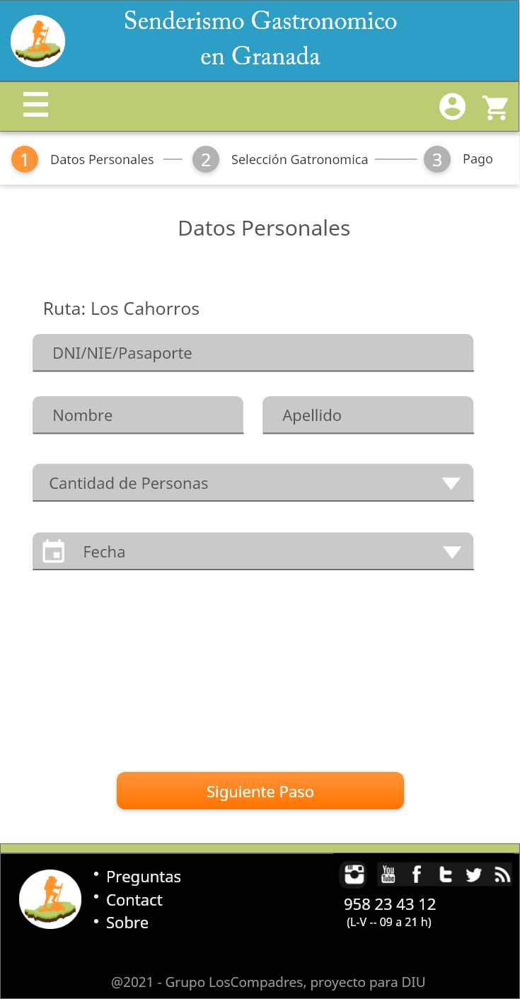

 3.e ¿My UX-Case Study?
-----

>>> Publicar my Case Study en Github..
>>> Documente y resuma el diseño de su producto en forma de video de 90 segundos aprox

## Paso 4. Evaluación 

 4.a Caso asignado
----

>>> Breve descripción del caso asignado con enlace a  su repositorio Github

 4.b User Testing
----

>>> Seleccione 4 personas ficticias. Exprese las ideas de posibles situaciones conflictivas de esa persona en las propuestas evaluadas. Asigne dos a Caso A y 2 al caso B
 

| Usuarios | Sexo/Edad     | Ocupación   |  Exp.TIC    | Personalidad | Plataforma | TestA/B
| ------------- | -------- | ----------- | ----------- | -----------  | ---------- | ----
| User1's name  | H / 18   | Estudiante  | Media       | Introvertido | Web.       | A 
| User2's name  | H / 18   | Estudiante  | Media       | Timido       | Web        | A 
| User3's name  | M / 35   | Abogado     | Baja        | Emocional    | móvil      | B 
| User4's name  | H / 18   | Estudiante  | Media       | Racional     | Web        | B 

. 4.c Cuestionario SUS
----

>>> Usaremos el **Cuestionario SUS** para valorar la satisfacción de cada usuario con el diseño (A/B) realizado. Para ello usamos la [hoja de cálculo](https://github.com/mgea/DIU19/blob/master/Cuestionario%20SUS%20DIU.xlsx) para calcular resultados sigiendo las pautas para usar la escala SUS e interpretar los resultados
http://usabilitygeek.com/how-to-use-the-system-usability-scale-sus-to-evaluate-the-usability-of-your-website/)
Para más información, consultar aquí sobre la [metodología SUS](https://cui.unige.ch/isi/icle-wiki/_media/ipm:test-suschapt.pdf)

>>> Adjuntar captura de imagen con los resultados + Valoración personal 

 4.d Usability Report
----

>> Añadir report de usabilidad para práctica B (la de los compañeros)

>>> Valoración personal 

## Paso 5. Evaluación de Accesibilidad  

  5.a Accesibility evaluation Report 
----

>>> Indica qué pretendes evaluar (de accesibilidad) sobre qué APP y qué resultados has obtenido 

>>> 5.a) Evaluación de la Accesibilidad (con simuladores o verificación de WACG) 
>>> 5.b) Uso de simuladores de accesibilidad 

>>> (uso de tabla de datos, indicar herramientas usadas) 

>>> 5.c Breve resumen del estudio de accesibilidad (de práctica 1) y puntos fuertes y de mejora de los criterios de accesibilidad de tu diseño propuesto en Práctica 4.

## Conclusión final / Valoración de las prácticas

>>> (90-150 palabras) Opinión del proceso de desarrollo de diseño siguiendo metodología UX y valoración (positiva /negativa) de los resultados obtenidos  

